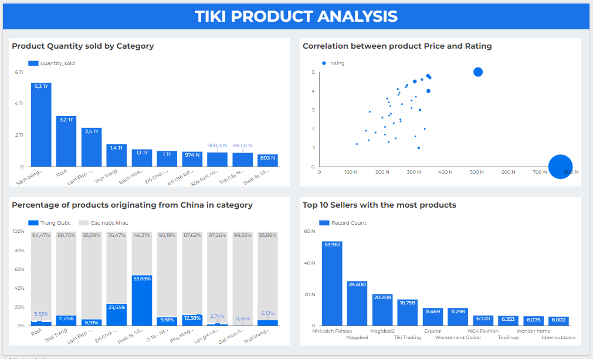

# Source

## 0. Setup
- Create a google cloud VM
- Install MongoDB on the VM to store Tiki product data
- Create a GCS bucket
- Create the BigQuery database and tables

## 1. Migrate data from MongoDB to GCS
Script: [migrate_data](src/migrate_data.sh)
### Workflow
- Export the `product` collection from the `tiki` database to a JSON file `product.json`
- Upload the JSON file to the `mongodb-data-1` bucket
- Use `parallel_composite_upload_threshold` to enable parallel composite uploads if the file size exceeds 150 megabytes
- After the upload process is done, remove the JSON file
- Use `crontab` to run the script at 22:00 everyday

## 2. Load data from the GCS bucket to a Big Query table
Script: [load_data](src/load_data.py)
### Workflow
- Create a Google Cloud Function that triggers when the file `product.json` is uploaded to the `mongodb-data-1` bucket and loads the data into the `product` table within the `tiki` database in BigQuery
- Write records that failed to load to the Big Query table to `failed_records.json` for later handling
- Output: [tiki_product_sample](data/processed_data/migrated_data)

## 3. Create a data mart containing seller and product infomation for the DA team to use
Script: [creat_datamart](src/create_datamart.sql)
### Workflow
- Create the `seller_product` database
- Create table `seller` and `product` from table `tiki.product`
- Output: [seller_sample](data/processed_data/datamart/seller.csv)/[product_sample](data/processed_data/datamart/product.csv)

## 4. Analyze and visualize data
Script: [analyze_data](src/analyze_data.sql)
### Workflow
- Create 2 tables
  - `product_information`: store product information - `id`, `product_name`, `category`, `seller`, `price`, `quantity_sold`, `rating`
  - `product_origin`:  store product origin information - `id`, `product_name`, `category`, `origin`
- Load the tables to Looker studio and visualize data

